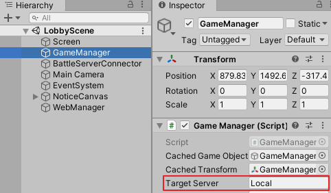

# ctc-game-client

### Game Project Simple Git Flow Rule

1. develop 브랜치에서 신규 브랜치 생성 feature/[new-branch-name]
2. feature/[new-branch-name] 에서 작업 후 merge request 하기 전 develop 에서 feature/[new-branch-name] 으로 merge
3. 충돌이 있다면 충돌 부분 작업자와 논의 후 충돌 해결
4. feature/[new-branch-name] 에서 develop으로 merge request
5. merge request 시 feature/[new-branch-name] 브랜치가 더 이상 필요 없다면 merge 후 삭제되게 체크
6. 승인자(파트원)들이 code review 후 approve

### Game Project Commit Message Simple Rule

commit types : feat, fix, build, chore, ci, docs, style, refactor, test

* feat : 새로운 기능에 대한 커밋
* fix : 버그 수정에 대한 커밋
* build : 빌드 관련 파일 수정에 대한 커밋
* chore : 그 외 자잘한 수정에 대한 커밋
* ci : CI관련 설정 수정에 대한 커밋
* docs : 문서 수정에 대한 커밋
* style : 코드 스타일 혹은 포맷 등에 관한 커밋
* refactor :  코드 리팩토링에 대한 커밋
* test : 테스트 코드 수정에 대한 커밋


---

## 외부 라이브러리

### SuperSocket

**SuperSocket is a light weight, cross platform and extensible** .Net/Mono socket server application framework. You can use it to build a server side socket application (like game server, GPS server, industrial control system, data acquisition server etc) easily without thinking about how to use socket, how to maintain the socket connections and how socket works.

홈페이지 : [https://www.supersocket.net/](https://www.supersocket.net/)

Github :  [https://github.com/kerryjiang/SuperSocket](https://github.com/kerryjiang/SuperSocket)

1.6 버전 사용 중

2.0의 경우 .NET Core 지원

- SuperSocket 1.6, 현 프로젝트 주요 클래스

    AppServer → BattleServer

    AppSession → BattleSession

    - [https://docs.supersocket.net/v1-6/en-US/Implement-your-AppServer-and-AppSession](https://docs.supersocket.net/v1-6/en-US/Implement-your-AppServer-and-AppSession)

    FixedHeaderReceiveFilter → BattleReceiveFilter

    - [https://docs.supersocket.net/v1-6/en-US/Implement-Your-Own-Communication-Protocol-with-IRequestInfo,-IReceiveFilter-and-etc](https://docs.supersocket.net/v1-6/en-US/Implement-Your-Own-Communication-Protocol-with-IRequestInfo,-IReceiveFilter-and-etc)
    - [https://docs.supersocket.net/v1-6/en-US/The-Built-in-Common-Format-Protocol-Implementation-Templates](https://docs.supersocket.net/v1-6/en-US/The-Built-in-Common-Format-Protocol-Implementation-Templates)

---

### MessagePack

Github  : [https://github.com/neuecc/MessagePack-CSharp](https://github.com/neuecc/MessagePack-CSharp)

서버 프로젝트에서는 NuGet에서 라이브러리 추가 (2.2.85)

클라이언트는 [https://github.com/neuecc/MessagePack-CSharp/releases](https://github.com/neuecc/MessagePack-CSharp/releases) 에서 MessagePack.Unity.2.2.85.unitypackage 다운로드 받아서 설치

패킷(BattleProtocol, CommonProtocol) 작성 시

패킷 클래스위에 [MessagePackObject] Attribute 작성

속성 값에 [Key(Number)] 명시

```csharp
[MessagePackObject]
public class ProtoBattleEnterResult : BaseProtocol
{
    [Key(1)]
    public ResultType ResultType;

    [Key(2)]
    public PlayerType PlayerType;
}
```

---

## Config

클라이언트에서 ALB 접근 정보

Assets\Resources\Local\Connect.json

Assets\Resources\Dev\Connect.json

BattleClient, Hierarchy에 있는 GameManager에서 TargetServer 지정에 따라 접근 정보 변경 됨.



GameServer에서 DB 접근 정보

서버 바이너리 실행 시 파라미터로 입력 (Local, Dev)
